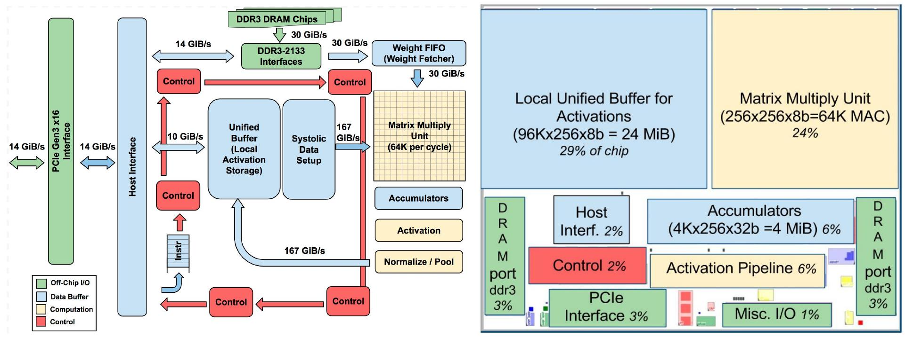

# TPUv1

Reproduction of Google TPU v1.

## Floor Plan



## Repository layout

| Directory | Contents |
|-----------|----------|
| `rtl/`    | Synthesizable SystemVerilog sources (`rtl/mxu/`: PE, delay chain, MXU) |
| `tb/`     | Testbenches, plus optional Python reference models (`tb/**/*_tb.py`) |
| `sim/`    | `make`-driven simulation flow (Icarus Verilog) |

## Build tools

| Tool | Purpose | Required |
|------|---------|----------|
| GNU Make | Drives the build via `sim/Makefile` | yes |
| Icarus Verilog (`iverilog` + `vvp`) | Compiles and runs the simulation. Version **11.0 or newer** recommended for the SystemVerilog used here | yes |
| Python 3 | Runs the reference-model check after a simulation | optional |
| GTKWave | Opens the VCD waveform (`make wave`) | optional |

### Ubuntu / Debian

```bash
sudo apt update
sudo apt install -y make iverilog gtkwave python3
```

The `iverilog` package ships both `iverilog` and `vvp`. Ubuntu 24.04 and
Debian 12 provide Icarus Verilog 11.0/12.0, which is fine. On older releases
(e.g. Ubuntu 20.04, Debian 11, which only have 10.x), build a newer one from
source:

```bash
sudo apt install -y autoconf gperf flex bison g++ make git
git clone https://github.com/steveicarus/iverilog.git
cd iverilog && sh autoconf.sh && ./configure && make -j"$(nproc)" && sudo make install
```

### Fedora

```bash
sudo dnf install -y make iverilog gtkwave python3
```

On RHEL / CentOS, enable EPEL first: `sudo dnf install -y epel-release`.

### Arch Linux

```bash
sudo pacman -S --needed base-devel iverilog gtkwave python
```

### macOS (Homebrew)

```bash
xcode-select --install         # provides GNU Make (and a C/C++ toolchain)
brew install icarus-verilog    # provides iverilog and vvp
brew install --cask gtkwave    # optional, for `make wave`
brew install python            # optional, for the reference model
```

Install Homebrew first if needed:
<https://brew.sh>.

### Windows

The recommended way is WSL2 with Ubuntu; then follow the Ubuntu steps above:

```powershell
wsl --install -d Ubuntu
```

```bash
# inside the WSL shell
sudo apt update && sudo apt install -y make iverilog gtkwave python3
```

`make wave` is a GUI feature: it works out of the box on Windows 11 (WSLg);
on Windows 10, use an X server or copy the generated `.vcd` file to Windows
and open it with GTKWave there.

For native Windows you can install Icarus Verilog together with GTKWave using
the official installer: <https://bleyer.org/icarus/>. Note that `sim/Makefile`
assumes a POSIX shell, so run `make` from MSYS2 (or WSL), or invoke `iverilog`
and `vvp` manually.

### Verify the installation

```bash
make --version
iverilog -V        # e.g. "Icarus Verilog version 12.0 ..."
vvp -V
python3 --version  # optional
```

## Quick start

```bash
cd sim
make              # compile + run the default testbench (pe_tb)
make list         # list all discovered testbenches
make mxu_tb       # compile + run one specific testbench
make regress      # run every discovered testbench
make wave         # run, then open the VCD in GTKWave
make clean        # remove build/
```

See `make help` (or the comments in `sim/Makefile`) for all targets and
variables such as `TOP`, `EXTRA_SRCS` and `IVFLAGS`.
